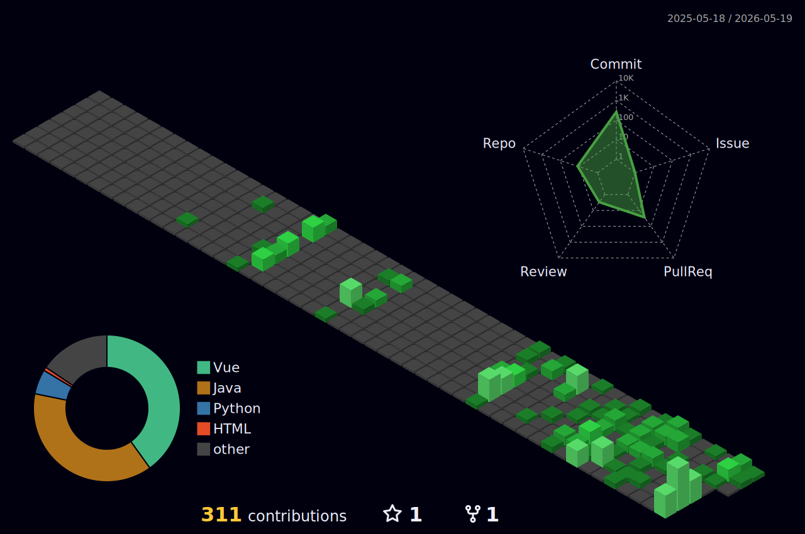

<!-- 
  ✨ Dynamic GitHub Profile for bingege-0729
  Backend Engineer | System Builder | Open Source Contributor
-->

<h1 align="center">Hi, I'm Nomade 👋</h1>

  

<b>Backend &amp; Frameworks</b>

 

  
  
  
  
 <!--  -->

<b>Data &amp; Infrastructure</b>

 

  
  
  
  
  
  

  
  <!--  -->

<!-- GitHub Snake -->
<!-- 

  

 -->

---

<h3>Personal Distribution</h3>

### 🛠️ Tech Stack

  

---
### 🚀 Featured Projects

| Project | Tech Stack | Description |
|---------|-----------|-------------|
| [🥡 take-out](https://github.com/bingege-0729/take-out) | Java + MySQL + Redis | 外卖订餐系统，完整交易流程与订单管理 |
| [📝 WenJi](https://github.com/bingege-0729/WenJi) | Java + Spring Boot + Vue | WenJi，一个旨在利用人工智能技术保护和传承非物质文化遗产的数字化平台 |
| [🎮 Corner](https://github.com/bingege-0729/Corner) | Java + Langchain4j + Vue +Spring Boot| Corner，基于情绪感知的个性化微出行决策助手 |

---
### 📈 Activity Graph

  

---

<h3>📬 How to Reach Me</h3> 

  
  

---

> 💡 *Profile auto-refreshed daily. Code commits speak louder than words.*
