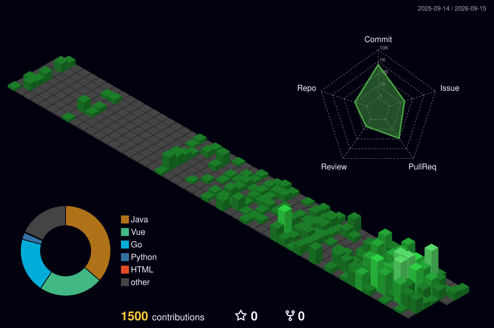

# bingege-0729

## About Me

Backend developer focused on scalable systems and AI-enabled products.

## Language Usage

  

## Featured Projects

| Project | Description | Tech Stack |
| --- | --- | --- |
| [Corner](https://github.com/bingege-0729/Corner) | A personalized micro-mobility decision assistant based on emotion awareness. | Java, Spring Boot, LangChain4j, Vue |
| [WenJi](https://github.com/bingege-0729/WenJi) | A digital platform for preserving and sharing intangible cultural heritage through AI-powered knowledge Q&A and multimodal interaction. | Java, Spring Boot, Vue, AI |
| [take-out](https://github.com/bingege-0729/take-out) | A campus food-delivery system covering the ordering and order-management flow. | Java, MySQL, Redis |

## Merged Open Source Contributions

| Pull Request | Contribution | Tech Stack |
| --- | --- | --- |
| [#2](https://github.com/VibingzzZ/NeoScholar/pull/2) | Implemented asynchronous student-profile merging. | Java, Spring Boot, CompletableFuture |
| [#4](https://github.com/VibingzzZ/NeoScholar/pull/4) | Added CI environment configuration and database initialization scripts. | GitHub Actions, MySQL |
| [#9](https://github.com/VibingzzZ/NeoScholar/pull/9) | Added JWT authentication, Spring Security authorization, Docker deployment, and test improvements. | Spring Security, JWT, Docker |
| [#17](https://github.com/VibingzzZ/NeoScholar/pull/17) | Connected frontend and backend APIs; completed authentication, tests, CI/CD, and deployment configuration. | Java, Vue, Spring Security, Docker, GitHub Actions |
| [#22](https://github.com/VibingzzZ/NeoScholar/pull/22) | Enhanced AI consultation with knowledge retrieval and learning assessment features. | DeepSeek, SSE, Vue |

## Personal Distribution

## Contact

[Email](mailto:2509094405@qq.com) · [CSDN Blog](https://blog.csdn.net/anonymous_zb)
